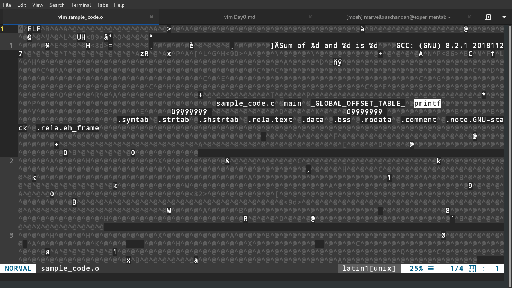

# Day 0 : An Awesome Day With Linux!

## Step-by-Step compilation of C Program:

As per I believe compilation of C Program is not a very tedious task. But the step-by-step compilation I believe could be done and viewed on Linux very easily.

So, I took this example to demonstrate how much the analysis is easy on Linux where as a bit difficult on other OS or better say is hidden behind the GUIs which is not a good news for a Computer Science scholar.

So, let's begin with the compilation process-

In this example we are going to use an open-source compiler named GCC to compile our C program.

There are four steps to compile a C program:

1. Pre-processing

2. Compilation

3. Assembly

4. Linking

First have a look at out program-
```c

#include <stdio.h>  // Included Library

// Defining macros
#define num1 5
#define num2 10
#define sum(a, b) (a+b)

int main()
{
	printf("Sum of %d and %d is %d", num1, num2, sum(num1, num2));
	return 0;
}
```

Let's see each step one-by-one:
### 1. Preprocessing-

This is the first phase through which source code is passed. This phase include:

* Removal of Comments
* Expansion of Macros
* Expansion of the included files.

Let's see the preprocessed file:
```bash
	$ gcc -E sample_code.c
```
Above command just shows the output preprocessed file on terminal. Let's see that inside a file.
```bash
	$ gcc -E sample_code.c | tee sample_code.i
```

The preprocessed output is stored in the sample_code.i. 
Let’s see what’s inside sample_code.i: using 
```bash
	$vi sample_code.i 
```
Here output seems as-
```c
# 1 "sample_code.c"
# 1 "<built-in>"
# 1 "<command-line>"
# 31 "<command-line>"
# 1 "/usr/include/stdc-predef.h" 1 3 4
# 32 "<command-line>" 2
# 1 "sample_code.c"
# 1 "/usr/include/stdio.h" 1 3 4
# 27 "/usr/include/stdio.h" 3 4
# 1 "/usr/include/bits/libc-header-start.h" 1 3 4
# 33 "/usr/include/bits/libc-header-start.h" 3 4
# 1 "/usr/include/features.h" 1 3 4
# 428 "/usr/include/features.h" 3 4
# 1 "/usr/include/sys/cdefs.h" 1 3 4
# 442 "/usr/include/sys/cdefs.h" 3 4
# 1 "/usr/include/bits/wordsize.h" 1 3 4

<SNIP>

# 8 "sample_code.c"
int main()
{
 printf("Sum of %d and %d is %d", 5, 10, (5 +10));
 return 0;
}

```


In the above output, source file is filled with lots and lots of info, but at the end our code is preserved.
Analysis:

* printf contains now a + b rather than add(a, b) that’s because macros have expanded.
* Comments are stripped off.
* #include<stdio.h> is missing instead we see lots of code. So header files has been expanded and included in our source file.

### 2. Compilation-
The next step is to compile sample_code.i and produce an; intermediate compiled output file sample_code.s. This file is in assembly level instructions. 
```bash
	$ gcc -S sample_code.c
```

Let’s see through this file using 
```bash
	$vi sample_code.s
```

Output now is-
```
	.file	"sample_code.c"
	.text
	.section	.rodata
.LC0:
	.string	"Sum of %d and %d is %d"
	.text
	.globl	main
	.type	main, @function
main:
.LFB0:
	.cfi_startproc
	pushq	%rbp
	.cfi_def_cfa_offset 16
	.cfi_offset 6, -16
	movq	%rsp, %rbp
	.cfi_def_cfa_register 6
	movl	$15, %ecx
	movl	$10, %edx
	movl	$5, %esi
	leaq	.LC0(%rip), %rdi
	movl	$0, %eax
	call	printf@PLT
	movl	$0, %eax
	popq	%rbp
	.cfi_def_cfa 7, 8
	ret
	.cfi_endproc
.LFE0:
	.size	main, .-main
	.ident	"GCC: (GNU) 8.2.1 20181127"
	.section	.note.GNU-stack,"",@progbits
```

### 3. Assembly-
In this phase the sample_code.s is taken as input and turned into sample_code.o by assembler. This file contain machine level instructions. At this phase, only existing code is converted into machine language, the function calls like printf() are not resolved.
```bash
	$ gcc -c sample_code.c
```

Let’s view this file using vim-
```bash
$vi sample_code.o
```


We can view there is the printf function which hasn't been linked till now and is to be linked in the next step.

### 4. Linking-
This is the final phase in which all the linking of function calls with their definitions are done. Linker knows where all these functions are implemented. Linker does some extra work also, it adds some extra code to our program which is required when the program starts and ends. For example, there is a code which is required for setting up the environment like passing command line arguments. This task can be easily verified by using $size sample_code.o and $size sample_code. Through these commands, we know that how output file increases from an object file to an executable file. This is because of the extra code that linker adds with our program.

```bash
	$ gcc sample_code.c -o sample_code
```

Now let's run this code-
```bash
	$ ./sample_code
```

And now I believe you are confortable with the compilation process of a C Program.

> To get the all intermediate files in the current directory along with the executable, do the following-
```bash
	$ gcc –Wall –save-temps sample_code.c –o sample_code 
```
---

## Basic Linux Commands-

#### ls:
ls (1)               - list directory contents
ls (1p)              - list directory contents

e.g-
```bash
	$ ls -l  # - is a file, d is a directory, l is a symbolic file, x is executable
	$ ls -a  # Concept of hidden files
	$ ls -al
	$ ls -r  # List in reverse name
	$ ls -t  # List new files
	$ ls -rt  # old first
```

#### cd:
cd (n)               - Change working directory
cd (1p)              - change the working directory

e.g-
```bash
	$ cd ~
	$ cd /
	$ cd -
	$ cd .
	$ cd ..
```

#### touch:
touch (1)            - change file timestamps
touch (1p)           - change file access and modification times
```bash
	$ touch textfile.txt
	$ touch test{1, 2, 3}.txt
```

#### cat:
cat (1)              - concatenate files and print on the standard output
cat (1p)             - concatenate and print files
e.g-
```bash
	$ cat textfile.txt
	$ cat -n textfile.txt  # Show line numbers
	$ cat > test.txt  # create file with initial input
	$ cat textfile.txt | more
	$ cat textfile.txt | less
	$ cat test test1 test2 > test3
```


#### less:
less (1)             - opposite of more
less (3perl)         - perl pragma to request less of something

e.g-
```bash
	$ less test.txt
```

#### more:
more (1)             - file perusal filter for crt viewing
more (1p)            - display files on a page-by-page basis

e.g-more can move forwards and backwards in text files but cannot move backwards in pipes.
```bash
	$ more test.txt
```

#### head:
head (1)             - output the first part of files
head (1p)            - copy the first part of files

e.g-
```bash
	$ head textfile.txt
	$ head -n 15 textfile.txt  # Show top 15 lines
```

#### tail:
tail (1)             - output the last part of files
tail (1p)            - copy the last part of a file

e.g-
```bash
	$ tail textfile.txt
	$ tail -n 15 textfile.txt  # Show bottom 15 lines
```

#### pwd:
pwd (n)              - Return the absolute path of the current working directory
pwd (1)              - print name of current/working directory
pwd (1p)             - return working directory name

e.g-
```bash
	$ pwd
```

#### mkdir:
mkdir (2)            - create a directory
mkdir (1)            - make directories
mkdir (1p)           - make directories
mkdir (3p)           - make a directory relative to directory file descriptor
e.g-
```bash
	$ mkdir folder
	$ mkdir -p ~/Desktop/a/b/c
```

#### cp:
cp (1)               - copy files and directories
cp (1p)              - copy files
e.g-
```bash
	$ cp test.txt ~/Documents/newname.txt
	$ cp -i  # Override or not
	$ cp -r folder-inside-folder/
```

#### mv:
mv (1)               - move (rename) files
mv (1p)              - move files
e.g-
```bash
	$ mv -i file.txt ~/Desktop/
	$ mv -v file.txt newname.txt  # Rename a file
```

#### rm:
rm (1)               - remove files or directories
rm (1p)              - remove directory entries
e.g-
```bash
	$ rm -r folder-inside-folder
	$ rm -i file  # Remove interactively
	$ rm -rf folder  # Remove folder recursively and files forcefully
```

#### wget:
wget (1)             - The non-interactive network downloader.

#### date:
date (1)             - print or set the system date and time
date (1p)            - write the date and time

e.g-
```bash
	$ date +'%d/%m/%y %H:%M:%S'
```

#### cal:
cal (1)              - display a calendar
cal (1p)             - print a calendar

#### top:
top (1)              - display Linux processes

#### man:
man (7)              - macros to format man pages
man (1p)             - display system documentation
man (1)              - an interface to the on-line reference manuals

#### grep:
grep (1)             - print lines that match patterns
grep (1p)            - search a file for a pattern

#### find:
find (n)             - search for classes and objects
find (1)             - search for files in a directory hierarchy
find (1p)            - find files

#### ps:
ps (1p)              - report process status
ps (1)               - report a snapshot of the current processes.

```bash
	$ ps aux | grep vlc
```

#### ssh:
ssh (1)              - OpenSSH SSH client (remote login program)

#### uname:
uname (2)            - get name and information about current kernel
uname (1)            - print system information
uname (1p)           - return system name
uname (3p)           - get the name of the current system

e.g-
```bash
	$ uname -a  # print all information
	$ uname -r  # kernel release
	$ uname -v  # kernel version
```

#### hostname:
hostname (7)         - hostname resolution description
hostname (1)         - show or set system host name
hostname (5)         - Local hostname configuration file

e.g-
```bash
	$ hostname
```

#### free:
free (1)             - Display amount of free and used memory in the system
free (3)             - allocate and free dynamic memory
free (3p)            - free allocated memory

e.g-
```bash
	$ free -m
```

#### whoami:
whoami (1)           - print effective userid

e.g-
```bash
	$ whoami
```

#### useradd:
useradd (8)          - create a new user or update default new user information
userdel (8)          - delete a user account and related files

#### kill:
kill (2)             - send signal to a process
kill (1)             - terminate a process
kill (1p)            - terminate or signal processes
kill (3p)            - send a signal to a process or a group of processes

e.g-
```
	$ kill 9981
	$ kill -9 9981
```

#### ip:
ip (8)               - show / manipulate routing, network devices, interfaces and tunnels
ip (7)               - Linux IPv4 protocol implementation

e.g-
```bash
	$ ip a
```

#### ifconfig:
ifconfig: 			 - Networking tool

e.g-
```bash
	$ ifconfig eth0
```

#### ping:
ping (8)             - send ICMP ECHO_REQUEST to network hosts

e.g-
```bash
	$ ping google.com
```

#### tar:
tar (1)              - an archiving utility
tar (5)              - format of tape archive files

e.g-
```
	* c – create a archive file.
	* x – extract a archive file.
	* v – show the progress of archive file.
	* f – filename of archive file.
	* t – viewing content of archive file.
	* z – filter archive through gzip.
```

```bash
	$ tar -cvf MyImages-14-09-12.tar.gz /home/MyImages  # Create tar Archive File
	$ tar -cvzf MyImages-14-09-12.tar.gz /home/MyImages  # Create tar.gz Archive File
	$ tar -xvf public_html-14-09-12.tar  # Untar tar, tar.gz, tar.bz2 Archive File
	$ tar -xvf public_html-14-09-12.tar -C /home/public_html/videos/  # Untar files in specified Directory
	$ tar -tvf uploadprogress.tar  # List Content of tar, tar.gz, tar.bz2 Archive File
	$ tar -xvf cleanfiles.sh.tar cleanfiles.sh  # Untar Single file from tar File
	$ tar -zxvf tecmintbackup.tar.gz tecmintbackup.xml  # Untar Single file from tar.gz File
```

#### rmdir:
rmdir (2)            - delete a directory
rmdir (1)            - remove empty directories
rmdir (1p)           - remove directories
rmdir (3p)           - remove a directory

e.g-
```bash
	$ rmdir foldername
```

### Package management:
```bash
	$ sudo apt-get install filezilla
	$ sudo apt-get remove filezilla
	$ sudo apt-get purge filezilla
	$ sudo apt-cache search filezilla
	$ sudo apt-cache show filezilla
	$ sudo apt-get update  # Resynchronize sources
	$ sudo apt-get upgrade  # Upgrade all packages to newest version
	$ sudo apt-get dist-upgrade  # Also upgrade dependencies
```
